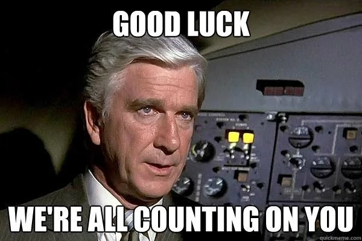
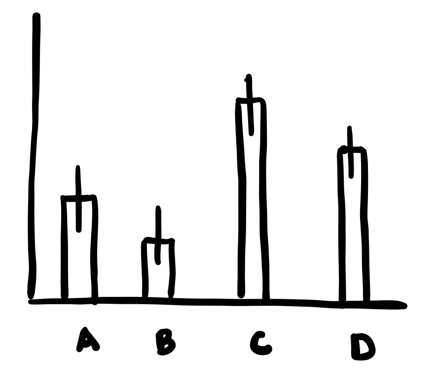

This midterm is worth 50 points and 20% of your overall grade. There are 9 pages and 20 questions in total. You may use **one** double-sided 8.5" x 11" sheet of paper with any notes you wish and a calculator. Please read each question carefully. If you get hung up on a question, skip it and come back to it later. Showing your work is always good practice where applicable - if you do so, be sure your final answer is obvious (circle or put a box around it)

{width="200" fig-align="center"}

1.  We'll start off easy. What is your name? (0 pt)
\bigskip
\bigskip

2.  Below is an excerpt from a paper that I was reading the other day, where the authors were measuring the impact of temperature on insect herbivory (total leaf area consumed) in both a controlled experiment comparing two temperature treatments, and an observational dataset in the field.

> "There was a significant increase in defoliation when herbivores and their plants were maintained at 35C as compared to those maintained at 25C (t = 3.76, *p* = 0.004). In addition, we observed a significant increase in the rate of herbivory as temperature increased in the field ($F_{1, 454}=143.6$ , *p* \< 0.001 )

- How many total plants were measured in the observational field study? (1 pt)
\bigskip
\bigskip

- Assuming the analyses were performed correctly, what error do you see in the reporting of the statistical tests conducted? (1 pt)
\bigskip
\bigskip

3. It's going to be almost 70°F this weekend! (that's totally normal, right?). You get excited because of this warming weather and go out to sample temperatures across the Metro area because you are curious how temperatures vary across a variety of different neighborhoods, and it's a chance to ride your bike around and bask in the spring weather. The temperatures you collect are normally distributed N(73, 9) (measured in degrees farenheit). What is the probability that a given neighborhood's temperature is greater than 73 degrees? (1 pt)
\bigskip
\bigskip
\bigskip
\bigskip

4. Imagine you are watching a seminar talk and the speaker puts up a graph associated with a one-way ANOVA design. They inform you that the 4 treatments were balanced, with 15 reps each. How many degrees of freedom do you expect to see in the F-statistic that they are about to display? (2 pts)

{width="200" fig-align="center"}

\bigskip
\bigskip

5. For a test-statistic value of $t=3.64$, which t-distribuition would have a smaller p-value asscoaited with the extremes of the tails: $t_{3}$ or $t_{40}$? (1 pt). Explain why this is the case (1 pt).

\bigskip
\bigskip
\bigskip
\bigskip
\pagebreak

6. For anyone who has been to Yellowstone National Park, you'll bear witness to some incredibly...we'll just say silly...acts of people attempting to photograph the wildlife (particularly bison). 

    I want to know whether cameras or a lack of cameras has an effect on the response of wildlife-visitor encounters. Here are the data on the number of wildlife-visitor encounters for 8, randomly sampled high-traffic areas in Yellowstone National Park split into two categories: where visitors either had or did not have cameras (or phones). There were 8, 7, 4, and 5 wildlife encounters in oparks where the tourists did not report using a camera. In the four locations where tourists did report having cameras, the number of reported incidents were 9, 8, 13, and 10. For this question, don't worry about data transformations. Below is an incomplete ANOVA table: please fill in the missing information. (6 pts)
    \bigskip
    \bigskip

    | Model term 	| Sum of Squares (SS) 	| Degrees of Freedom (df) 	| Mean Square (MS) 	| F-statistic 	|
    |------------	|:---------------------:|:-------------------------:|:-----------------:|:-------------:|
    | Camera     	|         ____          |           ____            |        ____      	|      8      	|
    | Error      	|          24         	|           ____           	|        ____      	|      NA      	|
    | Total      	|          56         	|           ____           	|         NA       	|      NA      	|


\pagebreak

7. In much of my research, I study wild bees and other flower-visiting insects. These critters are very attracted to certain colors of flowers (for those curious about this, look up "pollination syndromes"). We've been designing some camera traps and use a trap background with colors that mimic flowers to attract and photograph these insects. We conducted an experiment to see which color background was the most effective at attracting a genus of sunflower specialist bees, *Svastra*. Below are the data from that study graphed. Imagine you were to analyze these data in R and find that there are significant differences among groups in your overall $F$-test. You were sure to make the treatment variable a factor in your analysis, but you don't specify the factor level order in any way. List the values of the model **coefficient estimates** that you would see in the `summary()` table from your analysis. (9 pts)

```{r echo = FALSE, message = FALSE, fig.width=3.5, fig.height=2.75, fig.align='center'}
library(tidyverse)
data <- tibble(color = c("blue", "red", "yellow", "purple", "green"),
               visits = c(4, 2, 10, 3, 1),
               plot_color = c("#0072B2", "#D55E00", "#F0E442", "#CC79A7", "#009E73")) %>%
                mutate(color = factor(color, levels = c("yellow", "blue", "purple", "green", "red")))
data %>%
  ggplot() +
  geom_col(mapping = aes(x = color, 
                         y = visits,
                         fill = plot_color)) +
  scale_y_continuous(limits = c(0, 15), breaks = seq(0, 15, 1)) +
  ylab("Visits per hour") +
  xlab("Trap color") +
  scale_fill_identity() +
  theme_minimal() +
  theme(legend.position = "none") +
  theme(axis.line = element_line(color = "gray20"),
        panel.grid.major = element_line(color = "gray60"),
        panel.grid.minor = element_blank())
```

|  Model term 	| Coefficient Estimate ($\beta_i$) 	|
|:-----------:	|:--------------------------------:	|
| (Intercept) 	|               ____               	|
|     ____    	|               ____               	|
|     ____    	|               ____               	|
|     ____    	|               ____               	|
|     ____    	|               ____               	|

\bigskip
\pagebreak

8. Continuing from the previous question, I now give you some hypothetical data. There are only two replicates for each treatment. Here are the recorded visits per hour for the colors: Yellow: 5, 15; Blue: 2, 6; Purple: 5, 1; Green: 0, 2; Red: 2, 2. Draw and label the residual plot based on the previous graph. (5 pts)

```{r echo = FALSE, message = FALSE, fig.width=3.5, fig.height=2.75, fig.align='center'}
df <- data.frame(x = numeric(), y = numeric())
ggplot(df, aes(x = x, y = y)) +
  geom_blank() +
  xlim(0, 6) +
  ylim(-6, 6) +
  scale_y_continuous(limits = c(-6, 5), breaks = seq(-6, 6, 1), labels = NULL) +
  scale_x_continuous(limits = c(0, 6), breaks = seq(0, 6, 1), labels = NULL) +
  ylab("") +
  xlab("") +
  ggtitle("Residual plot") +
  theme_minimal() +
  theme(axis.line = element_line(color = "gray20"),
        panel.grid.major = element_line(color = "gray60"),
        panel.grid.minor = element_blank())
```
\bigskip
\bigskip

9. What model assumption appears to be violated based on this residual plot? (1 pt)
\bigskip
\bigskip

10. List the four assumptions of linear models in order of importance (mostest to most) (4 + 1 pts)
\bigskip
\bigskip
\bigskip
\bigskip
\pagebreak

11. Below is the output of an experiment testing whether the number of crimes in a neighborhood varies with the number of streetlights. There were five treatment categories established (0, 5, 10, 15, and 20 streetlights per block) and the reseracher got access to the number of crimes reported for each block. The researcher intends to analyze the experiment as an ANOVA and sends you their output to look over, since you're now the stats expert for all of your friends. 

```{r eval = FALSE}
summary(data)
crimes       streetlights
Min. : 7     Min. : 0
1st Qu.:11   1st Qu.: 5
Median :13   Median :10
Mean :13     Mean :10
3rd Qu.:15   3rd Qu.:15
Max. :22     Max. :20

fm1 <- lm(crimes ~ streetlights, data)

anova(fm1)
Analysis of Variance Table
Response: crimes
             Df  Sum Sq   Mean Sq   F value   Pr(>F)
streetlights 1   0.08     0.08      0.0066    0.9361
Residuals    23  279.92   12.17

summary(fm1)
Call:
lm(formula = crimes ~ streetlights, data = data)
Residuals:
Min     1Q     Median     3Q     Max
-6.00   -2.04  0.00       2.04   9.04
Coefficients:
               Estimate     Std. Error    t value     Pr(>|t|)
(Intercept)    12.92000     1.20849       10.691      2.14e-10 ***
streetlights   0.00800      0.09867       0.081       0.936
---

Signif. codes: 0 ‘***’ 0.001 ‘**’ 0.01 ‘*’ 0.05 ‘.’ 0.1 ‘ ’ 1
Residual standard error: 3.489 on 23 degrees of freedom
Multiple R-squared: 0.0002857,Adjusted R-squared: -0.04318
F-statistic: 0.006573 on 1 and 23 DF, p-value: 0.9361
```

Based on this output, which model assumption has been violated? (1 pt)
\bigskip
\bigskip

How would you fix this violation? (1 pt)
\bigskip
\bigskip

12. If I were to fit a linear regression model that had a pretty decent capacity to explain the variance in my data ($R^2$ value is 0.43), and I were to sum up the residuals, what would they add up to? (1 pt)
\bigskip
\bigskip

13. If I were to fit a linear regression model that was a perfect fit to my data ($R^2$ value is 1.00 - gasp!), and I were to sum up the residuals, what would they ad up to? (1 pt)
\bigskip
\bigskip
\bigskip
\bigskip

14. What are the two things that we can change about an experiment or observational study, and in what manner should we change them, to increase the power of our statistical tests? (4 pts)
\bigskip
\bigskip
\bigskip
\bigskip

15. Using an $R^2$ value, is it possible to determine if the slope of a linear regression line is positive or negative? (1 pt)
\bigskip
\bigskip
\bigskip
\bigskip

16. Suppose we collected some data on the distribution of tree heights around campus, and I wanted to use this sample to estimate what the probability was that a given tree was 10m tall or greater. I went ahead and used a Z-test to estimate the tail probability in this one-sample test. Was this the correct test statistic distribution to use and why? (2 pts)
\bigskip
\bigskip

17. You are examining the abundance of prairie dogs in a prairie in Texas. You setup a lawn chair, prepare a beverage for yourself, and count the number of prairie dogs you see every 10 minutes for 12 hours (I hope you brought sun screen!). You notice that often things were really quiet (with no prairie dogs), while other times it was like a prairie dog block party. 

    When fitting a model to explain these data, you notice your model errors are not normally distributed, so you try a $ln(y)$ transformation. When you plot a summary of your data, you notice an error. What happened in your transformation? (1 pt)
\bigskip
\bigskip

    Which transformation might you prefer instead? (1 pt)
\bigskip
\bigskip


18. I am trying to build a regression model to determine what variables affect how fast foxes can run. I have captured N = 36 foxes, weighed and measured them, and then measured their speed with a radar gun after release in a soccer field. The two independent variables with which I am working, length and weight of a fox, are highly correlated. Let’s say that on their own, each variable is significant at P <0.05 (i.e., simple linear regressions examining the effect of fox length on speed and the effect of fox weight on speed). The coefficient estimates are negative, indicating that longer and heavier foxes run more slowly than shorter and lighter foxes. 

    If I were to build a multiple regression model (i.e, including both variables as predictors of fox speed), I might expect that the marginal effects of both variables when examined with the summary() command would be (circle one; 1 pt)

      (a) Both significant
      \smallskip
      (b) Significant, but only the first one placed in the model statement
      \smallskip
      (c) Significant, but only the last one placed in the model statement
      \smallskip
      (d) Both insignificant

    What is this phenomenon called? (citcle one; 1 pt)

      (a) Bias
      \smallskip
      (b) Masking
      \smallskip
      (c) Shirinkage
      \smallskip
      (d) Degrees of freedom
\bigskip
\bigskip

19. I ask `R` for the probability under the curve for a t-distribution for a value of 0.69 and 14 degrees of freedom. A value of 0.2507365 is returned (one-tail, `lower.tail = FALSE`). Draw a picture of the distribution and shade the curve for the probability being returned. (1 pt)
\bigskip
\bigskip
\bigskip
\bigskip
\bigskip
\bigskip

    If I were to specify `lower.tail = TRUE`, what would probability would R return? (1 pt)
\bigskip
\bigskip

20. A study was conducted to examine how the quality of oranges might deteriorate with delays between harvest and packing. For this study, y is a measurement of fruit quality (on a 10 point scale with 10 being the best), and x denotes the number of hours after being picked that the oranges were packed for shipping. The simple linear regression line is y = 9.5− 0.5x. The estimates of both the intercept and the slope are significantly different from zero. What does the intercept tell us in this model? (1 pt)
\bigskip
\bigskip

    Imagine we have a 2 hour delay in orange packing because somebody thought they saw an Asian Citrus Psyllid, the vector of the bacterial pathongen that causes Citrus Greening disease, in the production line. What would be our estimated quality score given such a delay? (1 pt)
\bigskip
\bigskip

---

**Super special bonus question time! (+ 1 pt)**

Complete the statement: Always analyze an experiment/observational study...


---

**Have a great Spring Break! See you all in a week. Just kidding, see you in like 15 minutes for lab :)**