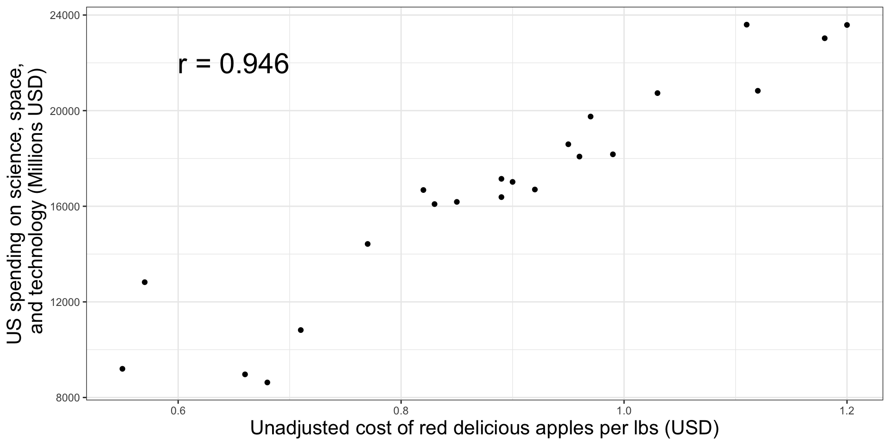
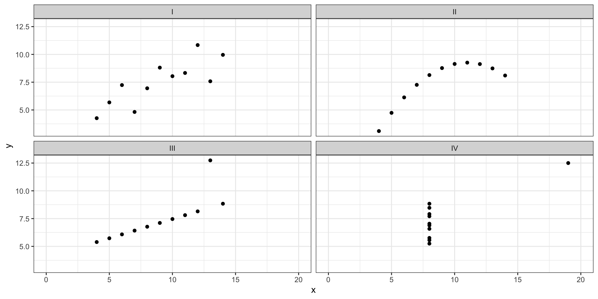
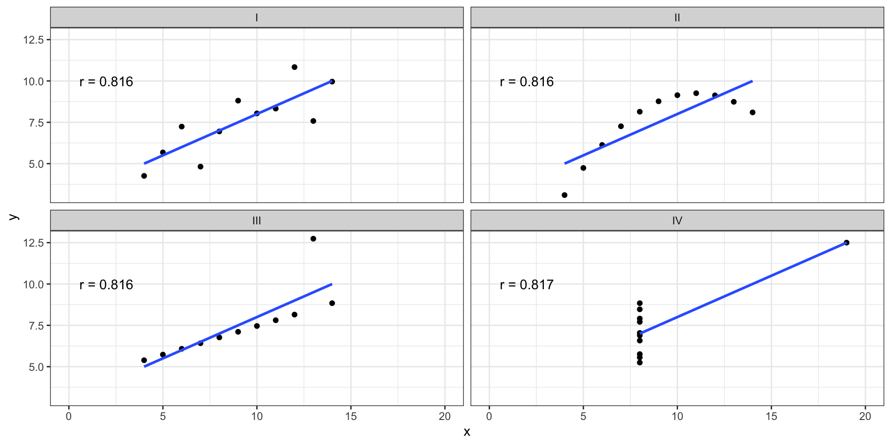
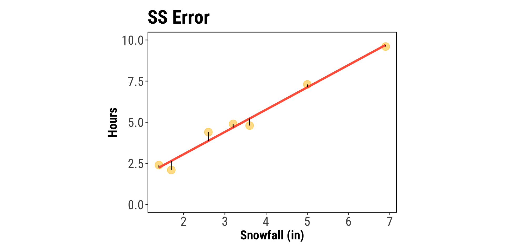
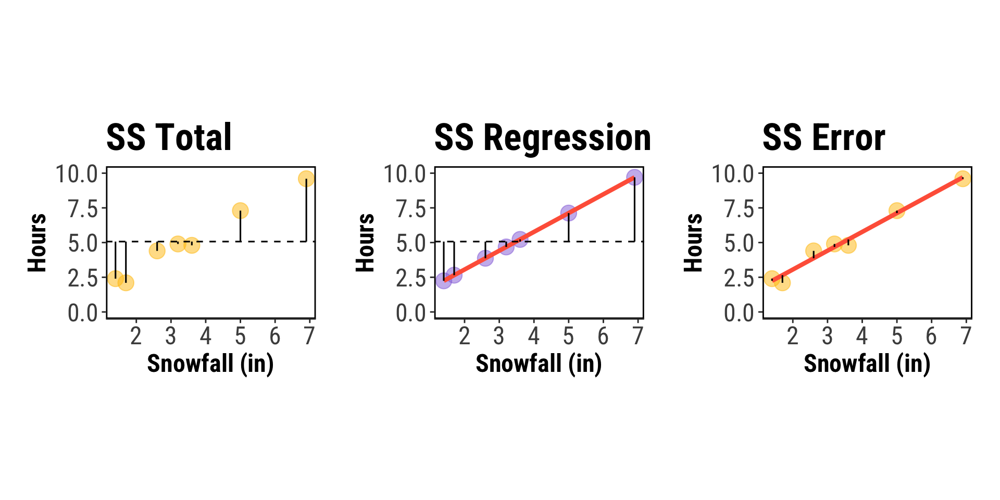

# What we'll cover today

## Simple linear regression

. . .

::: box-1-list
[]{.margin-1} Approaches to linear regression
:::

. . . 

::: indented-text
<i class="fa-solid fa-turn-up fa-rotate-90"></i> Experimental vs. observational studies
:::

. . .

::: box-1-list
[]{.margin-1} Correlation
:::

. . . 

::: indented-text
<i class="fa-solid fa-turn-up fa-rotate-90"></i> Measuring the relationship between two continuous variables
:::

. . . 

::: box-1-list
[]{.margin-1} Simple linear regression
:::

. . . 

::: indented-text
<i class="fa-solid fa-turn-up fa-rotate-90"></i> Using least-squares (sum of squares) approach to fitting and testing a model
:::

# Approaches to linear regression

## The general concept

:::box-6-list
In regression analyses, we want to understand if there is a *statistically clear* relationship between two continuous variables, say $x$ and $y$.
:::

. . . 

::: indented-text
<i class="fa-solid fa-turn-up fa-rotate-90"></i> $x$ may be a variable that we manipulated experimentally (e.g., temperature). The approach here is [experimental]{.highlight-tomato}
:::

. . . 

::: indented-text
<i class="fa-solid fa-turn-up fa-rotate-90"></i> $x$ may also be a variable that we simply measured (e.g., total rainfall). The approach here is [observational]{.highlight-tomato}
:::

. . . 

::: indented-text
<i class="fa-solid fa-turn-up fa-rotate-90"></i> We can also include categorical variables in regression (i.e., ANOVA!)
:::

. . . 

::: indented-text
<i class="fa-solid fa-turn-up fa-rotate-90"></i> Correlation/regression are used to [infer linkages]{.highlight-tomato} between variables and [quantify the strength]{.highlight-tomato} of these links
:::

::: {.callout-warning}
Correlation ≠ causation! 
:::


## FYI: read this paper!


# Correlation
:::box-6-list
Correlation is a measure of a [linear]{.highlight-tomato} relationship between our response variable $y$ and some predictor variable $x$. 
:::

. . . 

::: indented-text
<i class="fa-solid fa-turn-up fa-rotate-90"></i> We want to quantify how variables "move together" or how informative one variable is to *predict* values of another variable. 
:::

. . . 

::: indented-text
<i class="fa-solid fa-turn-up fa-rotate-90"></i> Just like our other statistical parameters we've been discussing, we differentiate between population and sampole correlation parameters!
:::

## Population correlation coefficient
:::box-6-list
- $\rho = Corr(X, Y) = \frac{Cov(X, Y)}{\sqrt{Var(X)}\sqrt{Var(Y)}}$ is the population correlation coefficient between $X$ and $Y$
:::

. . . 

::: indented-text
<i class="fa-solid fa-turn-up fa-rotate-90"></i> $-1 \leq \rho \leq 1$
:::

. . .

::: indented-text
<i class="fa-solid fa-turn-up fa-rotate-90"></i> $\rho = 1$ indicates a perfect positive correlation
:::

. . .

::: indented-text
<i class="fa-solid fa-turn-up fa-rotate-90"></i> $0 < \rho < 1$ indicates a positive correlation
:::

. . . 

::: indented-text
<i class="fa-solid fa-turn-up fa-rotate-90"></i> $\rho = 0$ indicates no linear relationship
:::

. . .

::: indented-text
<i class="fa-solid fa-turn-up fa-rotate-90"></i> $-1 < \rho < 0$ indicates a negative correlation
:::

. . .

::: indented-text
<i class="fa-solid fa-turn-up fa-rotate-90"></i> $\rho = -1$ indicates a perfect negative correlation
:::

## Sample correlation coefficient
:::box-6-list
$r$ is the sample correlation coefficient and it is calculated similarly to $\rho$
:::

$$r = \frac{\sum_{i = 1}^n (x_i - \bar{x}) (y_i - \bar{y})}{\sqrt{\sum_{i = 1}^n (x_i - \bar{x})^2} \sqrt{\sum_{i = 1}^n(y_i - \bar{y})^2}}$$

. . . 

::: {.callout-note}
The same guidelines/parameters about $\rho$ apply to $r$!
:::

. . . 

::: {.callout-tip}
$r$ is directly related to the $r^2$ we are all very familiar with! It's quite literally our sample correlation coefficient squared! We'll come back to this and show the math a bit later...
:::

## How do we calculate correlation?
- Use R
- in R:    `my_correlation <- cor.test(x, y)`

:::center-x

::: {.cell}
::: {.cell-output .cell-output-stdout}

```

	Pearson's product-moment correlation

data:  x and y
t = 30.853, df = 48, p-value < 2.2e-16
alternative hypothesis: true correlation is not equal to 0
95 percent confidence interval:
 0.9573578 0.9862104
sample estimates:
     cor 
0.975702 
```


:::
:::

:::

## Beware of spurious correlation!


::: {.cell}
::: {.cell-output-display}
{width=960}
:::
:::

## Where does correlation fail?
- Correlation measures a **linear** relationship - if your data are not linear correlation will fail to capture the relationship

:::center-x

::: {.cell}
::: {.cell-output-display}
{width=576}
:::
:::

:::

## Where does correlation fail? | A lesson in plotting your data


::: {.cell}
::: {.cell-output-display}
{width=960}
:::
:::


## Where does correlation fail? | A lesson in plotting your data


::: {.cell}
::: {.cell-output-display}
{width=960}
:::
:::


# Simple linear regression

## Why can't we just stop at our correlation coefficient? 
:::box-6-list
If we've calculated a $r$ statistic, we can't we just report that and be done with it? 
:::

. . .

::: indented-text
<i class="fa-solid fa-turn-up fa-rotate-90"></i> While the r value quantifies the correlation between our variables, it tells us nothing about [uncertainty]{.highlight-tomato} in the model that we are building. Uncertainty is key to developing hypothesis tests, predictions, and assessing the biological meaning of our model!
:::

. . .

::: indented-text
<i class="fa-solid fa-turn-up fa-rotate-90"></i> Linear regression lets us futher build out the model of our system so that we can [estimate the strength of a biological relationship]{.highlight-tomato} rather than simply a mathematical one!
:::

## Simple linear regression
**Snowfall example**


::: {.cell}
::: {.cell-output-display}
`````{=html}
<table class="table table-striped table-condensed" style="width: auto !important; ">
 <thead>
  <tr>
   <th style="text-align:right;"> Amount of snowfall (in) </th>
   <th style="text-align:right;"> # of hours to clear street </th>
  </tr>
 </thead>
<tbody>
  <tr>
   <td style="text-align:right;"> 3.2 </td>
   <td style="text-align:right;"> 4.9 </td>
  </tr>
  <tr>
   <td style="text-align:right;"> 1.4 </td>
   <td style="text-align:right;"> 2.4 </td>
  </tr>
  <tr>
   <td style="text-align:right;"> 2.6 </td>
   <td style="text-align:right;"> 4.4 </td>
  </tr>
  <tr>
   <td style="text-align:right;"> 6.9 </td>
   <td style="text-align:right;"> 9.6 </td>
  </tr>
  <tr>
   <td style="text-align:right;"> 3.6 </td>
   <td style="text-align:right;"> 4.8 </td>
  </tr>
  <tr>
   <td style="text-align:right;"> 1.7 </td>
   <td style="text-align:right;"> 2.1 </td>
  </tr>
  <tr>
   <td style="text-align:right;"> 5.0 </td>
   <td style="text-align:right;"> 7.3 </td>
  </tr>
</tbody>
</table>

`````
:::
:::


:::box-6-list
Question of interest: What is the relationship between the amount of snow fall ($x$) and the time it takes to clear the streets ($y$)?
:::

## Simple linear regression
**Snowfall example**


::: {.cell}
::: {.cell-output-display}
{width=960}
:::
:::


## Simple linear regression
**Snowfall example | Step 1: fit a line**

:::box-6-list
The main idea behind linear regression is fitting a straight line to our data *(Recall equation for a straight line $y = mx + b$)*:
:::

. . .

$$
y = b_0 + b_1x
$$

. . . 

::: indented-text
<i class="fa-solid fa-turn-up fa-rotate-90"></i> Here $b_0$ is the y-intercept and $b_1$ is the slope.
:::

. . . 

::: indented-text
<i class="fa-solid fa-turn-up fa-rotate-90"></i> The goal is to find the coefficients that give the line of best fit
:::

## Simple linear regression
**Snowfall example | Step 1: fit a line**

:::box-6-list
There are a variety of methods to find the coefficients $b_0$ and $b_1$ but the most common is [least squares]{.highlight-tomato}.
:::

. . . 

::: indented-text
<i class="fa-solid fa-turn-up fa-rotate-90"></i> Find $b_0, ~b_1$ that minimize the "sum of squares" of our regression line
:::

$$\sum_{i = 1}^n (y_i - \hat{y_i})^2$$

::: indented-text
<i class="fa-solid fa-turn-up fa-rotate-90"></i> where $y_i$ is your observed value and $\hat{y}_i$ is the value $y$ of the line $\hat{b}_0 + \hat{b}_1x_i$
:::

## Simple linear regression
**Snowfall example | Step 1: fit a line**


## Simple linear regression
**Snowfall example | Step 1: fit a line - regression coefficients**

:::box-6-list
There are equations to find our coefficients though! We don't have to do it by trial and error!
:::

. . . 

$$\hat{b}_1 = \frac{\sum_{i= 1}^{n} (x_i - \bar{x}) (y_i - \bar{y})}{\sum_{i = 1}^{n} (x_i - \bar{x})^2}$$

. . . 

$$= \frac{\sum_{i = 1}^{n} x_i y_i - \frac{1}{n}( \sum_{i = 1}^{n} x_i)(\sum_{i = 1}^{n} y_i)}{\sum_{i = 1}^{n} x_i^2 - \frac{1}{n}(\sum_{i = 1}^{n} x_i)^2}$$

. . .

and

$$\hat{b}_0 = \bar{y} - \hat{b}_1\bar{x}$$

## Simple linear regression
**Snowfall example | Step 1: fit a line - regression coefficients**

$$\sum_{i=1}^n x_i = 24.40, ~\sum_{i=1}^n x_i^2 = 107.42, ~\sum_{i=1}^n x_i y_i = 154.07$$

$$\sum_{i=1}^n y_i = 35.50, \sum_{i=1}^n y_i^2 = 222.03$$

Thus

$$\hat b_1 = \frac{154.07-24.40\times 35.50/7}{107.42-24.4\times 24.40/7} = \frac{30.33}{22.37} = 1.356$$

$$\hat b_0 = 35.50/7-1.356\times 24.40/7 = 0.345$$

## Or just use R


::: {.cell}

```{.r .cell-code}
m1 <- lm(hours_to_clear_streets ~ snowfall_inches, data = snowfall)

coef(m1)
```

::: {.cell-output .cell-output-stdout}

```
    (Intercept) snowfall_inches 
      0.3455231       1.3557926 
```


:::
:::


## Simple linear regression
**Snowfall example | Step 2: calculate uncertainty**

:::box-6-list
Our model equation is great, but it doesn't allow us to assess any uncertainty around out predictions. How can we do this?
:::

. . .

::: indented-text
<i class="fa-solid fa-turn-up fa-rotate-90"></i> We model $y$ as a random variable $Y$
:::

. . . 

::: indented-text
<i class="fa-solid fa-turn-up fa-rotate-90"></i> Consider $x$ to be fixed, but $x$ could be random
:::

. . . 

::: indented-text
<i class="fa-solid fa-turn-up fa-rotate-90"></i> Consider the model of $Y$ conditional on $x$ such that $([Y|x])$, so...
:::

$$E(Y|x) = b_0 + b_1x$$

::: indented-text
<i class="fa-solid fa-turn-up fa-rotate-90"></i> where $b_0, b_1$ are fixed unknown parameters (intercept and slope) that characterize the relationship between $x$ and $y$
:::

## Simple linear regression
**Snowfall example | Step 2: calculate uncertainty**

:::box-6-list
We now have a more formal equation for our linear model:
:::

. . .

$$Y_i = b_0 + b_1 x_i + e_i$$

. . .

::: indented-text
<i class="fa-solid fa-turn-up fa-rotate-90"></i> $Y$ is called a *dependent variable* or a *response variable*
:::

. . .

::: indented-text
<i class="fa-solid fa-turn-up fa-rotate-90"></i> $x$ is called an *independent variable* or *covariate*
:::

. . . 

::: indented-text
<i class="fa-solid fa-turn-up fa-rotate-90"></i> $e's$ are called *errors* and are the distance between our observation and fitted line
:::

::: {.callout-tip}
This model, like the generalized one we developed for ANOVA, lets us reconstruct our dataset exactly!
:::

## Simple linear regression
**Snowfall example | Step 3: Evaluate model assumptions**

1) The model is correct. In this case,

$$E(Y_i) = b_0 + b_1 x_1$$

::: indented-text
<i class="fa-solid fa-turn-up fa-rotate-90"></i> That is, $y$ is a function of the linear combination of our $x$ variables (only 1 in the case of simple linear regression).
:::

2) Errors $e_i$ are independent.
3) Errors $e_i$ have homogeneous variance: $Var(e_i) = \sigma^2$
4) Errors $e_i$ have normal distribution: $e_i \sim N(0, \sigma^2)$

## Simple linear regression
**Snowfall example | Step 3: Evaluate model assumptions**

:::box-6-list
We estimate the model our model parameters using the data that we have gathered, such that:
:::

. . .

::: indented-text
<i class="fa-solid fa-turn-up fa-rotate-90"></i> $b_0, b_1, \sigma^2$ by estimators $\hat{b}_0, \hat{b}_1, \hat{\sigma}^2$
:::

. . .

::: indented-text
<i class="fa-solid fa-turn-up fa-rotate-90"></i> $\sigma^2$ is analagous to MSErr from ANOVA
:::

. . .

::: {.callout-tip}
Provided our model assumptions are met (via diagnostic plots, etc.), we can go onto testing hypothese about our model parameters!
:::

## Simple linear regression
**Snowfall example | Step 4: Hypothesis testing**

:::box-6-list
In our example, we're interested in quantifying the relationship between snowfall and cleanup time. We can formalize this research question into a hypothesis! 
:::

. . . 

$H_0$: There is no association between the amount of snowfall and  the number of hours it takes to clear the streets.

. . .

$H_A$: There is an association between the amount of snowfall and the number of hours it takes to clear the streets.

## Simple linear regression
**Snowfall example | Step 4: Hypothesis testing**

:::box-6-list
Generally, the most common hypothesis tested in regression is if there is a significant association between your $x$ and $y$ variables. This can be determined by testing if the slope of the regression is different than 0.
:::

$H_0 : b_1 = 0$

$H_A: b_1 \neq 0$

. . . 

::: indented-text
<i class="fa-solid fa-turn-up fa-rotate-90"></i> To accomplish this, we can use both analysis of variance (ANOVA) or a T-test!
:::

## Simple linear regression
**Snowfall example | Step 4: Hypothesis testing**

:::box-6-list
Let's start with ANOVA: Recall that ANOVA stands for "**AN**alysis **O**f **VA**riance"
:::

. . . 

::: indented-text
<i class="fa-solid fa-turn-up fa-rotate-90"></i> We want to split up the total variation of our data and describe how much of the variation is explained by the model and how much variation is left unexplained.
:::

. . . 

::: indented-text
<i class="fa-solid fa-turn-up fa-rotate-90"></i> We will partition the sum of squares (SS):
:::

$$SS~Total = SS~Regression + SS~Error$$

## 

$$SSTotal = \sum_{i = 1}^{n}(y_i - \bar{y})^2, ~df = n - 1$$


::: {.cell}
::: {.cell-output-display}
{width=960}
:::
:::


## 

$$SSRegression = \sum_{i = 1}^{n}(\hat{y_i} - \bar{y})^2, ~df = 1$$


::: {.cell}
::: {.cell-output-display}
{width=960}
:::
:::


## 

$$SSError = \sum_{i = 1}^{n}(y_i - \hat{y_i})^2, ~ df = n - 2$$


::: {.cell}
::: {.cell-output-display}
{width=960}
:::
:::


## 

$$SSTotal = SSReg + SSErr$$


::: {.cell}
::: {.cell-output-display}
{width=960}
:::
:::


## Poorly fitting model

::: {.cell}
::: {.cell-output-display}
{width=960}
:::
:::


## Simple linear regression
**Snowfall example | Step 4: Hypothesis testing**

:::box-6-list
So, to test our hypothesis for the slope, let's construct our ANOVA table:
:::


::: {.cell}
::: {.cell-output-display}
`````{=html}
<table class="table table-striped" style="margin-left: auto; margin-right: auto;">
 <thead>
  <tr>
   <th style="text-align:left;"> Source </th>
   <th style="text-align:right;"> df </th>
   <th style="text-align:center;"> Sum of Squares </th>
   <th style="text-align:center;"> Mean Square (SS / df) </th>
   <th style="text-align:center;"> F </th>
  </tr>
 </thead>
<tbody>
  <tr>
   <td style="text-align:left;"> Regression </td>
   <td style="text-align:right;"> 1 </td>
   <td style="text-align:center;"> 41.13 </td>
   <td style="text-align:center;"> 41.130 </td>
   <td style="text-align:center;"> 239.13 </td>
  </tr>
  <tr>
   <td style="text-align:left;"> Error </td>
   <td style="text-align:right;"> 5 </td>
   <td style="text-align:center;"> 0.86 </td>
   <td style="text-align:center;"> 0.172 </td>
   <td style="text-align:center;"> - </td>
  </tr>
  <tr>
   <td style="text-align:left;font-weight: bold;"> Total </td>
   <td style="text-align:right;font-weight: bold;"> 6 </td>
   <td style="text-align:center;font-weight: bold;"> 41.99 </td>
   <td style="text-align:center;font-weight: bold;"> - </td>
   <td style="text-align:center;font-weight: bold;"> - </td>
  </tr>
</tbody>
</table>

`````
:::
:::


. . .

::: indented-text
<i class="fa-solid fa-turn-up fa-rotate-90"></i> We estimate $\sigma^2$ by $s^2 = MSError = 0.172$ on $df = 2$.
:::

$$F = \frac{MSReg}{MSErr} \sim F_{1, ~ n-2}$$

## Simple linear regression
**Snowfall example | Step 4: Hypothesis testing**

:::box-6-list
So, to test our hypothesis for the slope, let's construct our ANOVA table:
:::


::: {.cell}
::: {.cell-output-display}
`````{=html}
<table class="table table-striped" style="margin-left: auto; margin-right: auto;">
 <thead>
  <tr>
   <th style="text-align:left;"> Source </th>
   <th style="text-align:right;"> df </th>
   <th style="text-align:center;"> Sum of Squares </th>
   <th style="text-align:center;"> Mean Square (SS / df) </th>
   <th style="text-align:center;"> F </th>
  </tr>
 </thead>
<tbody>
  <tr>
   <td style="text-align:left;"> Regression </td>
   <td style="text-align:right;"> 1 </td>
   <td style="text-align:center;"> 41.13 </td>
   <td style="text-align:center;"> 41.130 </td>
   <td style="text-align:center;"> 239.13 </td>
  </tr>
  <tr>
   <td style="text-align:left;"> Error </td>
   <td style="text-align:right;"> 5 </td>
   <td style="text-align:center;"> 0.86 </td>
   <td style="text-align:center;"> 0.172 </td>
   <td style="text-align:center;"> - </td>
  </tr>
  <tr>
   <td style="text-align:left;font-weight: bold;"> Total </td>
   <td style="text-align:right;font-weight: bold;"> 6 </td>
   <td style="text-align:center;font-weight: bold;"> 41.99 </td>
   <td style="text-align:center;font-weight: bold;"> - </td>
   <td style="text-align:center;font-weight: bold;"> - </td>
  </tr>
</tbody>
</table>

`````
:::
:::


. . .

We can then calculate the tail probability on $F_{1, 5}$, p-value << 0.01. Reject $H_0$! We have strong evidence that the slope is not 0. 

## Simple linear regression
**Snowfall example | Step 4: Hypothesis testing**

:::box-6-list
Alternatively, we can conduct this hypothesis test using a t-test:
:::

. . .

::: indented-text
<i class="fa-solid fa-turn-up fa-rotate-90"></i> $\hat{b}_1$ is a function of our random variables $X$ and $Y$, thus it is itself a random variable
:::

$$\hat b_1 = \frac{\sum_{i=1}^n (x_i-\bar x)(Y_i-\bar Y)}{\sum_{i=1}^n (x_i-\bar x)^2} = \frac{\sum_{i=1}^n (x_i-\bar x) Y_i}{\sum_{i=1}^n (x_i-\bar x)^2}$$

. . . 

::: indented-text
<i class="fa-solid fa-turn-up fa-rotate-90"></i> Because $\hat{b}_1$ is a weighted sum of random distributions, it also has a normal distribution so we can use the t-test to determine if $\hat{b}_1$ is significantly different from 0.
:::

$$t = \frac{\bar{x} - \mu}{SE} = \frac{\hat{b}_1 - b_1^*}{s_{\hat{b}_1}} = \frac{1.356}{0.0877} = 15.46$$

. . . 

::: indented-text
<i class="fa-solid fa-turn-up fa-rotate-90"></i> $p < 0.01$, so we can reject the null hypothesis ($H_0: b_1 = 0$)
:::


## Simple linear regression
**Snowfall example | Step 4: Hypothesis testing**

Check out the summary of our `lm` object to see this in action:


::: {.cell}
::: {.cell-output .cell-output-stdout}

```

Call:
lm(formula = hours_to_clear_streets ~ snowfall_inches, data = snowfall)

Residuals:
      1       2       3       4       5       6       7 
 0.2159  0.1564  0.5294 -0.1005 -0.4264 -0.5504  0.1755 

Coefficients:
                Estimate Std. Error t value Pr(>|t|)    
(Intercept)      0.34552    0.34688   0.996    0.365    
snowfall_inches  1.35579    0.08855  15.311 2.16e-05 ***
---
Signif. codes:  0 '***' 0.001 '**' 0.01 '*' 0.05 '.' 0.1 ' ' 1

Residual standard error: 0.4188 on 5 degrees of freedom
Multiple R-squared:  0.9791,	Adjusted R-squared:  0.9749 
F-statistic: 234.4 on 1 and 5 DF,  p-value: 2.156e-05
```


:::
:::


. . .

::: {.callout-caution}
This only holds up when our model has a numerator degrees of freedom of 1 (i.e., 1 predictor variable in the model!)
:::

## Simple linear regression
**Snowfall example | Step 4: Hypothesis testing**

:::box-6-list
We can conduct a similar t-test to assess the significance of our model intercept, this is similar to what we did in 1 and 2-way ANOVA. I'll spare you the math here, and just jump to the conclusions
:::

. . . 

::: indented-text
<i class="fa-solid fa-turn-up fa-rotate-90"></i> If we are testing $H_0: b_0 = 0$ then the t-test for the intercept can be seen as choosing between $Y_i = b_1 x_1 + e_i$ (a model with no intercept) and the model $Y_i = b_0 + b_1 * x_i + e_i$ under the $H_A$.
:::

. . . 

::: indented-text
<i class="fa-solid fa-turn-up fa-rotate-90"></i> We almost *always* leave the intercept in our models, unless we have a strong biological rationale for forcing the intercept through the origin (0,0). 
:::

## Simple linear regression
**Snowfall example | Step 5: assessing model fit**

- $R^2$ can be used to assess model fit

- $R^2 = \frac{SS~Regression}{SS~Total}$

- $R^2$ represents the proportion of the total SS that is explained by the regression model

## Link between $r$ and $R^2$

- Correlation is important in regression analysis
- In lab, you will (or have) learned that $R^2$ is the proportion 
of variation in the response variable explained by our experimental factor
- Put mathematically, $R^2 = \frac{SSTrt}{SSTotal}$
- For a simple linear regression $R^2 = r^2$.
- Put another way, $r = \sqrt{R^2}$

## Simple linear regression
**Snowfall example | Step 6: make predictions**

Yay! We have a model! We can use it to make predictions, like, how many hours should we expect to clear the streets given 4" of snowfall?

. . . 


::: {.cell}

```{.r .cell-code}
predict(m1, newdata = data.frame("snowfall_inches" = 4))
```

::: {.cell-output .cell-output-stdout}

```
       1 
5.768693 
```


:::
:::


. . .

::: {.callout-caution}
Be careful! Interpolation (predicting between our observed values) is generally okay, but extrapolation (predicting outside our observed values) may be inaccurate if the linear relationship changes outside the range of our observed variables.
:::
